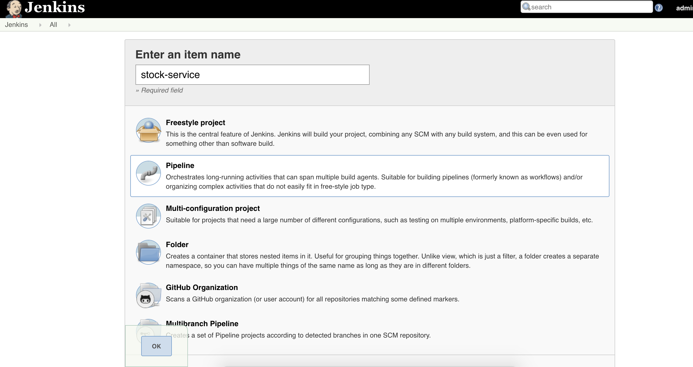
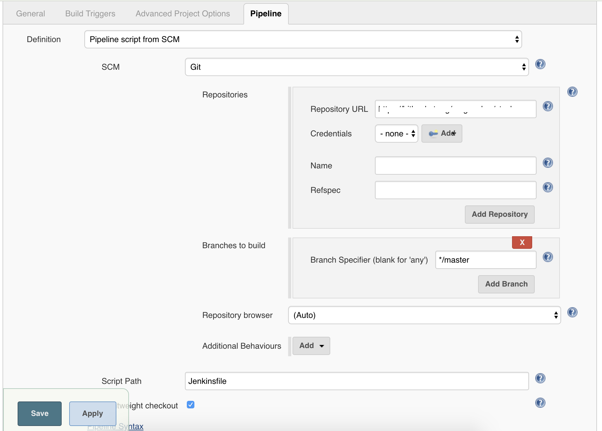
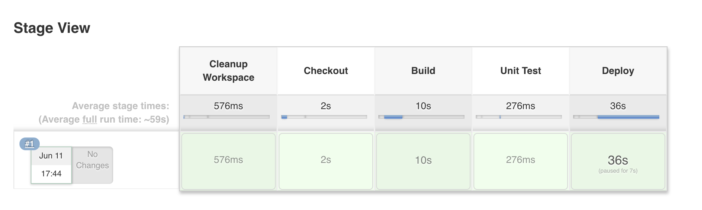
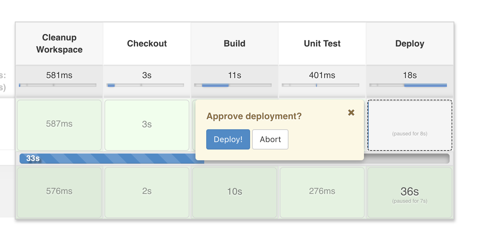

# Jenkins Pipeline for CI/CD
## Prerequisites
* [Jenkins](https://jenkins.io/download/) 
* [docker](https://docs.docker.com/) 
* [docker-compose](https://docs.docker.com/compose/install/)

##  Getting Started
* Download and install Jenkins. 
* In Jenkins, make sure to install docker and docker-compose.

### Jenkins Pipeline
* From the Jenkin's Dashboard, select New Item. 
  * Enter an Item Name and select Pipeline
  * Select OK

  

* Click on the Pipeline Tab 
  * Definition: Pipeline script from SCM
  * SCM: Git
  * Repositories:  Input the repository URL and credentials [select None if it's a public repository]
  * Branches to build: For this example, I used */master. You can also create a parameterized project.
  * Script Path: Jenkinsfile
* Click SAVE.

  

#### Jenkins Pipeline Stage View
  * Cleanup Workspace
    * Cleanup workspace before building the project. 
    * Delete exited containers.
  * Checkout
    * Checkout the branch to build
  * Build
  * Unit Test
  * Deploy
    * Wait for the approver's signal before executing this stage. Otherwise, abort pipeline. 

  

#### Jenkins Pipeline Approval Stage

  

 

### docker-compose.yml
Do not forget to update MYSQL's root password. 

```
...
  service-stock-mysql:
    image: mysql:5.7
    environment:
      MYSQL_ROOT_PASSWORD: <YOUR_DB_PASSWORD>
...
```

Adjust the number of replica accordingly.

```
...
  php:
    image: custom-php:latest
    deploy:
      replicas: 2
    volumes:
      - ./:/var/www/
...
```

